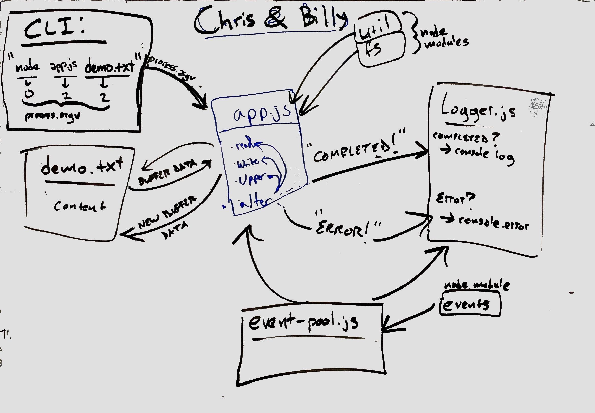

 LAB 16
=================================================

## Lab 16
### Chris Merritt
### Links and Resources
* [PR](https://github.com/401-advanced-javascript-merritt/lab-16/pull/1)

#### Documentation

* [jsdoc](https://merritt-lab16.herokuapp.com/docs/index.html)

### Modules
#### `modulename.js`
* app.js:
  * readIn:
    Reads a file and returns a promise.

  * writeOut:
    Write to a file and return a promise.
    
  * toUpper:
    Change a string to uppercase then a Buffer.
    
  * alterFile:
    Function to wrap all the promises and run the function.

* logger.js: 
    Listen for the events then log the time, type of event, and payload.

* event-pool.js
    Create a new event listener.

### Setup
#### `.env` requirements
* `npm i`

#### Running the app
* `cd src`
* `node app.js demo.txt`
  
#### Tests
* How do you run tests?
  * `npm run test`
  * `npm run lint`

* Mock for reading:
  Checks that the file path is valid, then returns a buffer.
* Mocks for writing: 
  Checks that the file path is valid, then returns a buffer.

#### UML

